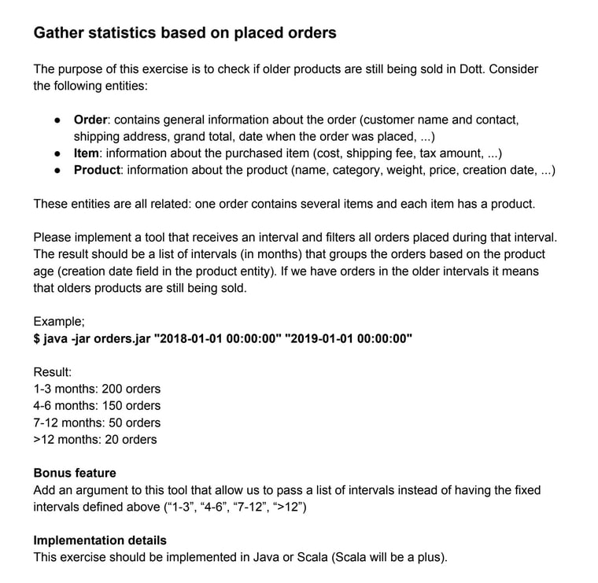

# Dott
This project is a test assignment. Here's its description:


### Note
In the email I was offered to solve it both with a "simple" straightforward approach, and "overengineered" one.
Since I recently developed and deployed [some personal application](https://github.com/ElijahLaMoon/ukrnastup-comments) I decided to use it as my guideline and started with a database, SQLite, which I also used in that application.
Naturally, it quickly became a canvas for an "overengineered" solution, so I decided to stick to it.
However, soon enough to be able to implement basic required functionality I realized it's going to take way too much time, so I abandoned it midway.
Still, I have wasted a really decent chunk of time allowed for completion of the assignment, and I'm not happy with the result.

## Overview
`overengineered` folder contains some redundant files, which I intended to use in one of the solutions, but the reason why I abandoned it is explained [above](#note), so it serves no purpose for now.

`simple` folder, on the other hand, contains the actual one.
It has a following structure:
```
simple/src
├── main
│   └─...
│     ├── App.scala
│     ├── DataGenerator.scala
│     ├── model
│     │   ├── Category.scala
│     │   ├── Item.scala
│     │   ├── Order.scala
│     │   └── Product.scala
│     └── package.scala
└── test
   └─...
      └── OrderSuite.scala
```
1. `App` - launcher of the app.
Generates some random data, accepts 2 time intervals (more on that in [run section](#how-to-run)), performs analytics given aforementioned input, and prints the result to STDOUT.
2. `DataGenerator` - utility object with some predefined data and methods to generate random data.
3. `model/` - pretty much self-explanatory, basic models required by the assignment.
`Category` is a little convient ADT
4. `package` - a couple of useful methods.
5. `test/.../OrderSuite` - test suite wtih a couple of general unit tests.
Unfortunately, I didn't have time to abstract over application's code so I could same methods (and, well, test them) in the actual code and tests, so this suite mostly duplicates code in `App`'s `main` method.

## How to run
Since the project is incomplete, you need `sbt` installed locally.
Project expects 2 time intervals in the format `YYYY-MM-DD`, and the later has to be more recent.
Optionally, takes a number of orders to generate, if not provided generates __1500__ by default.

For example following input __might__ produce such results,
```scala
$ sbt
> run 2013-01-01 2019-05-6 
Products added between 2013-01-01T00:00 and 2016-05-02T00:00: Product(Simon L. Peyton Jones, The Implementation of Functional Programming Languages,Books,0.402,16.49,2015-05-04T00:00), Product(Paul Chiusano, Functional Programming in Scala,Books,0.267,13.49,2014-08-01T00:00)
Orders placed in timeframes:
1-3 months: 0 orders
4-6 months: 0 orders
7-12 months: 0 orders
>12 months: 455 orders

> run 2022-01-01 2024-01-01 30000
Products added between 2022-01-01T00:00 and 2024-01-01T00:00: Product(Google Pixel 6,Electronics,0.3,499,2022-11-30T00:00), Product(Martin Odersky, Programming in Scala 5th edition,Books,0.512,19.99,2023-12-08T00:00), Product(Bartosz Milewski, Category Theory for Programmers,Books,0.354,14.99,2022-04-30T00:00)
Orders placed in timeframes:
1-3 months: 1672 orders
4-6 months: 744 orders
7-12 months: 1809 orders
>12 months: 6281 orders

> run 2023-12-27 2024-01-01 23
Products added between 2023-12-27T00:00 and 2024-01-01T00:00:
Orders placed in timeframes:
1-3 months: 0 orders
4-6 months: 0 orders
7-12 months: 0 orders
>12 months: 0 orders
```
